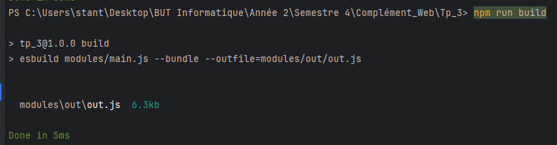
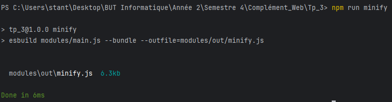

# Micro-site e-commerce

### TROHA Stanislas S4 RA-IL 1

___
## TD n°3 : modules & tableaux

## Informations
Le serveur a été lancé avec : 
``php -S localhost:8000`` à la racine du projet.


### Bundler
Pour les fichiers de sortie générés via esbuild, j'ai choisi de les mettre dans **[modules/out/](/modules/out)**.  
Il y a donc le fichier **[out.js](modules/out/out.js)** généré via : ``npm run build`` (script créé dans **[package.json](package.json)**). 
  
Et aussi le fichier **[minify.js](modules/out/minify.js)** généré via : ``npx esbuild modules/main.js --bundle --minify --outfile="modules/out/minify.js"`` aussi disponible en tant que script dans **[package.json](package.json)**.  
  


## Exercices supplémentaires

### Exercice 10
J'ai décidé de créer une fonction ``setCallbackAddToCart(callback)`` dans **[ui.js](modules/ui.js)**. Elle prend en paramètre une fonction callback qui sert par la suite au **eventHandler** du bouton d'ajout au panier d'un article.  
Je vérifie ensuite, dans ```displayProduct(product)``` si une fonction de callback pour le panier a été ajoutée, si oui, alors on lui fait appel lors d'un évènement "click" sur le bouton d'ajout au panier.  

Cette fonction callback est créée dans **[app.js](modules/app.js)** et prend un produit en paramètre. Elle ajoute le produit au panier, et actualise ensuite la vue du panier.  
**[app.js](modules/app.js)** finit par utiliser ``setCallBackAddToCart(callback)`` après avoir créé le callback et c'est opérationnel.  


### Exercice 11
Les **données du panier** sont stockées dans le **stockage local** du navigateur. Lorsqu'on **vide** le panier alors le **couple (clé, valeur)** dans le stockage local du navigateur est **supprimé**.  
La gestion des **données du panier** contenues dans le navigateur se fait dans **[cart.js](modules/cart.js)**

### Exercice 12 
J'ai ajouté un argument supplémentaire dans le constructeur d'un produit dans **[products.js](modules/products.js)**. Si aucune url n'est fournie lors de la création d'un produit, alors une url par défaut est attribuée.  
Ensuite c'est dans ``displayProduct(product)`` dans **[ui.js](modules/ui.js)** que j'ajoute une balise `` et la valeur de l'attribut _photo_ du produit.  


